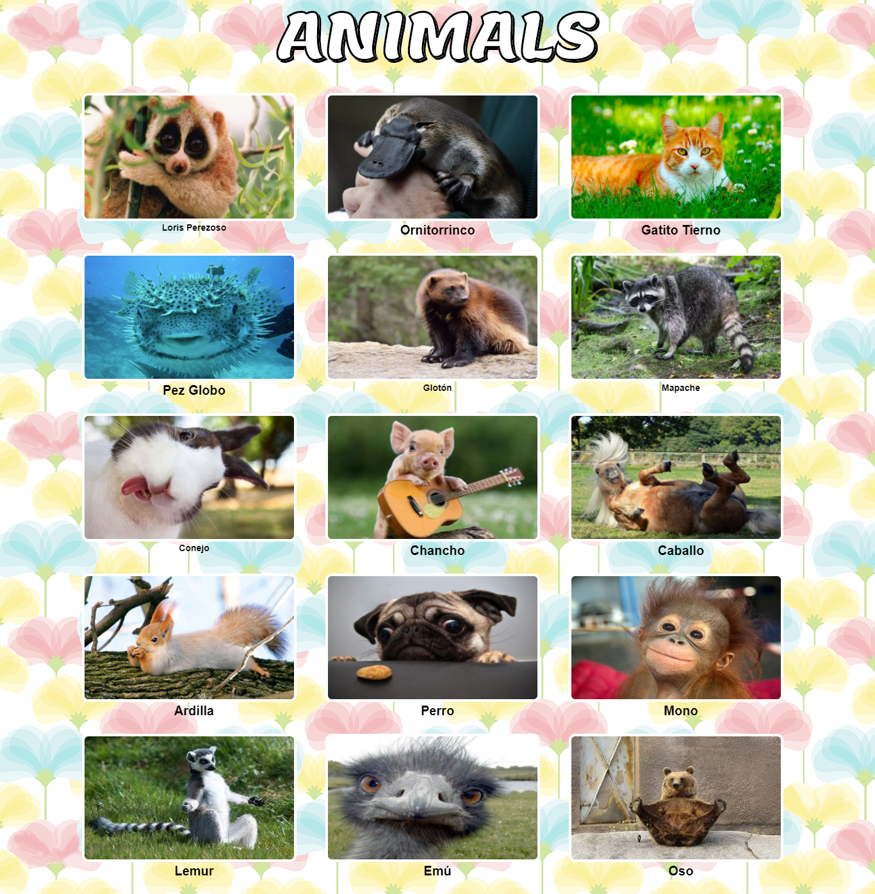
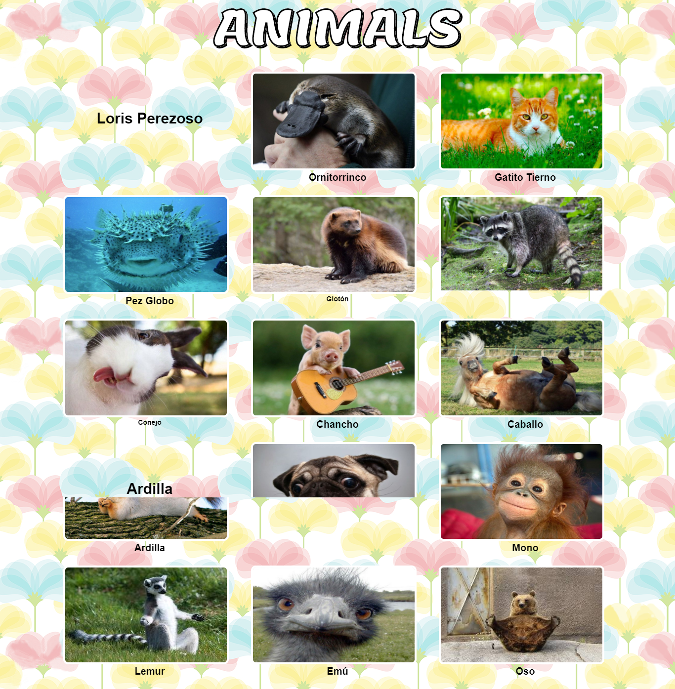

# **Cardify**

* **Track:** _Common Core_
* **Curso:** _JS Deep Dive: Crea tu propia librería usando JavaScript_
* **Unidad:** _Producto final_
* **Front-ends:** _Aurora Vásquez Sanchez y Jessica Manturano_

***

Implementar un plugin de jQuery que dado un _contenedor_ debe buscar todas las
imágenes que encuentre dentro del _contenedor_ y reemplazarlas por un nuevo
elemento `<figure>` que contenga la imagen (``) además de un `<figcaption>`
con el texto del atributo `alt` de la imagen.

## Flujo de trabajo
Para el desarrollo de este trabajo estamos haciendo uso de diferentes ramas para evitar conflictos y perdida de informacion cada rama tiene informacion relevante y paso a paso de la funcionalidad de este plugin.

Planificación de trabajo con [Trello](https://trello.com/b/gsC83EJh/cardify-reto-sprint-04)

***

## Funcionalidad:
El plugin de Cardify busca todas las imagenes que se encuentren dentro de un contenedor y semanticamente las coloca dentro de una etiqueta **figure** junto con una etiqueta **figcaption** que adquiere el texto del atributo **alt** de dicha imagen.Este plugin contiene estilos css y de bootstrap ya definidos.

## Cómo agregar Cardify a tu proyecto

### Requisitos previos

primero necesitarás enlazar el siguiente archivo a tu index.html:

<script type="text/javascript" src="nombre_carpeta/cardify.js"></script>


### Global (navegador)

```html
<script src="https://ajax.googleapis.com/ajax/libs/jquery/3.2.1/jquery.min.js"></script>

<script src="path-to-cardify.js"></script>
```

## Uso

```js
En tu archivo app.js deberás colocar la siguiente línea de código:

$('.container-img').cardify();

y para que se ejecute la función el usuario debe poner en el elemento html que contenga en su interior elementos de etiqueta 'img'  
La clase **'.container'**

<div class="container-img">
  
</div>
```

## Ejemplos

Asi es como se ve antes de pasar el mouse


Al pasar el mouse se produce un  **hover** que  realiza la funcionalidad del plugin.
