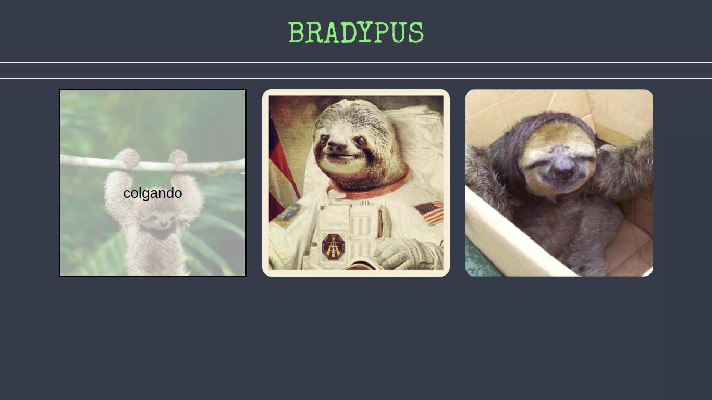

[](https://github.com/meliveloz/cardify)
# Cardify

* **Track:** _Common Core_
* **Curso:** _JS Deep Dive: Crea tu propia librería usando JavaScript_
* **Unidad:** _Producto final_

***
Es un plugin de jQuery que dado un _contenedor_ busca todas las
imágenes que encuentra dentro del _contenedor_ y las reemplaza por un nuevo
elemento `<figure>` que contiene la imagen (``) además  un `<figcaption>`
con el texto del atributo `alt` de la imagen.
Además al pasar el mouse sobre la imagen lograremos ver el contenido del `<figcaption>`.
***

### Metodología de Tabajo

+ Se utiliza la herramienta trello para la organización de actividades, propuestas y recursos.

+ Herramientas para comunicación grupal, slack para trabajo en forma remota y no perder comunicación de todos los pasos de los intengrantes.

### Requerimientos Técnicos

El proyecto fue realizado con las siguientes dependencias NPM:

+ Dependencias de Producción
  - JQuery ~v. 3.2.1
  - Bootstrap ~v. 3.3.7
  - Chai ^4.1.2
  - Mocha ^5.0.0

### Levantamiento ambiente de desarrollo

+ Clonar repositorio.
+ Posicionado en nuestro proyecto hacer correr `npm install` para descargar e instalar todas las dependencias utilizadas.

### Instalación

Global (navegador)

```
  <script src="https://ajax.googleapis.com/ajax/libs/jquery/3.2.1/jquery.min.js"></script>
  <script src="path-to-cardify.js"></script>
```
### Uso
```
  // `container` es el selector del contenedor donde se buscarán todas las
  // imágenes a ser procesadas.
  $(container).cardify({});
```

### Ejemplo




### Licencia

+ [ISC License](https://opensource.org/licenses/ISC)
   
