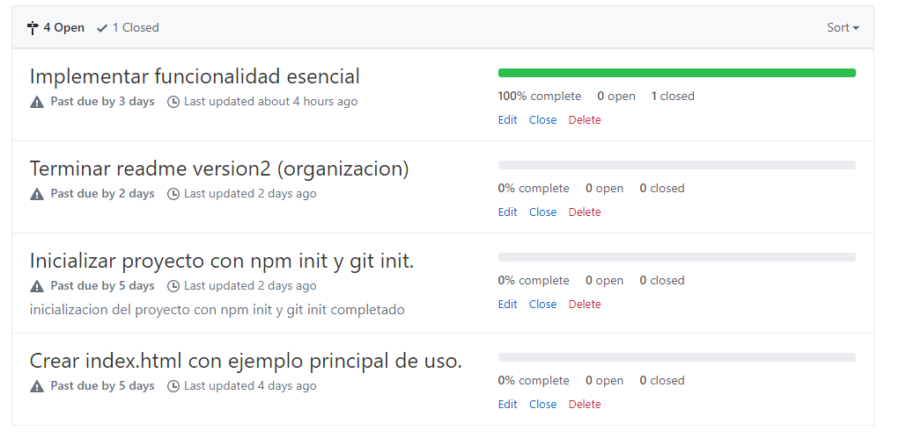

# Cardify

Cardify es un proyecto  que se nos pidio implementar como parte de la creacion de una librería (library), teniendo como objetivo responder a la necesidad de hacer mas legible o evitar estar repitiendo codigo para paginas web o aplicaciones moviles.

## Equipo Conformado

> Jennifer Carmen

> Valeria Valles 

## Organizacion de equipo

Como parte de la organizacion en equipo se implemento los issues y los milestones.

 


y parte de asiganacion de tareas se hiso lo siguiente.

Jennifer Carmen encargada en : 

* Investigacion de implementacion del plugin 
* Creacion de Issues 
* Funcionalidad 
* Maquetacion ejemplos de documentacion de la pagina del plugin

Valeria Valles encarga en :

* Investigacion de implementacion del plugin 
* Readme 
* Funcionalidad 
* Maquetacion del contenido de la pagina del plugin


## Requisitos del Proyecto

Implementar un plugin de jQuery que dado un _contenedor_ debe buscar todas las
imágenes que encuentre dentro del _contenedor_ y reemplazarlas por un nuevo
elemento `<figure>` que contenga la imagen (``) además de un `<figcaption>`
con el texto del atributo `alt` de la imagen.

## Pruebas

Las pruebas se pueden encontrar en la test/test.js para las pruebas de versión de jQuery . Simplemente abra su index.html archivo en su navegador y todas las pruebas se deben ejecutar con éxito.

## Como usar cardefy


Si está utilizando jQuery , debe incluir el scrip en el html de su pagina . Funciona con jQuery> = 3.2.1.

#### Entorno de desarrollo 

1.Descargar Cardify  o clonarlo desde GitHub

2.Descomprímalo (si está comprimido) y copie la carpeta Cardify en sus scripts JS.

3.Inserta el siguiente código en tu página web:

```html
<script src="src/index.js"></script>
<script src="TuApp.js"></script>
```

Cardify necesita imágenes completamente cargadas para leer sus dimensiones correctamente. Si no está seguro de cuándo sucederá esto, puede usar este fragmento de código con cada imagen:

```
// jQuery
$('.container-cardify').pluss({ align: 'horizontal',
    direction: 'tb'
  });
```
## Documentacion

### Introduccion 

Cardify es un complemento que le proporciona una mejor manera de mantener a desarrolladores o diseñadores de implementar funcionalidades mas rapidas y accesibles.

Cardify se  ajusta a su imagen en  div, y agrega una superposición dentro de este envoltorio. Luego, cambiará al pasar el mouse el figcaption se mostrara superponiendose a la imagen.

Cardify solo funcionará en img elementos proporcionados por id.

por ejemplo :

```
 <div class="container-cardify">      
     
     
 </div>
```
Y no funcionara por ejemplo si no cuenta con un class="container-cardify" .

```
 <div>
    
     
</div>
```
### Inicialización

Cardify necesita ser inicializado en un class de contenedor antes de su uso.

```
$('.container-cardify').pluss({ align: 'horizontal',
    direction: 'tb'
  });
```


