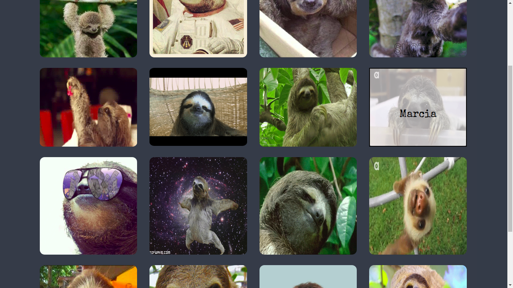

[](https://github.com/meliveloz/cardify)  []() 

# Cardify

***
Es un plugin de jQuery que permite que tus imágenes almacenadas dentro de un contenedor sean reemplazadas por un nuevo elemento `<figure>` que a su vez posee un `<figcaption>` con el texto del atributo `alt` de la imagen.
Además al pasar el mouse sobre la imagen lograremos ver el contenido del 
`<figcaption>`.
***
 
### Metodología de Tabajo

+ Se utiliza la herramienta trello para la organización de actividades, propuestas y recursos.

+ Herramientas para comunicación grupal, slack para trabajo en forma remota y no perder comunicación de todos los pasos de los intengrantes.

### Requerimientos Técnicos

El proyecto fue realizado con las siguientes dependencias NPM:

##### Dependencias de Producción
  - JQuery ~v. 3.2.1
  - Bootstrap ~v. 3.3.7
  - Jsdom ^11.6.1
  - Browserify ^15.2.0
  - ESlint ~v 4.16.0

##### Dependencias de Desarrollo
  - Chai ^ 4.1.2
  - Mocha ^ 5.0.0
  - Browserify ^ 15.2.0 

### Levantamiento ambiente de desarrollo

+ Clonar repositorio.
+ Posicionado en nuestro proyecto hacer correr `npm install` para descargar e instalar todas las dependencias utilizadas.

### Instalación

Global (navegador)

```
  <script src="https://ajax.googleapis.com/ajax/libs/jquery/3.2.1/jquery.min.js"></script>
  <script type="text/javascript" src="lib/main.js"></script>
```

### Uso

```
  Debes colocar la clase `cardify` al contenedor donde se irán todas las
  imágenes a ser procesadas.

```

### Ejemplo




### Licencia

+ [ISC License](https://opensource.org/licenses/ISC)
   
